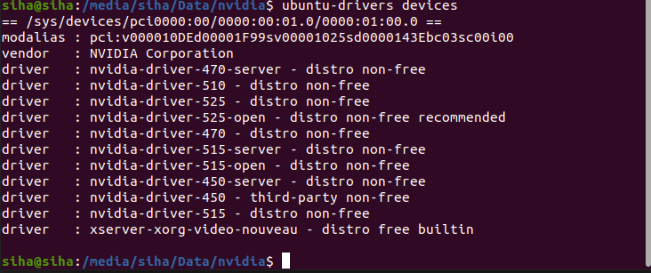
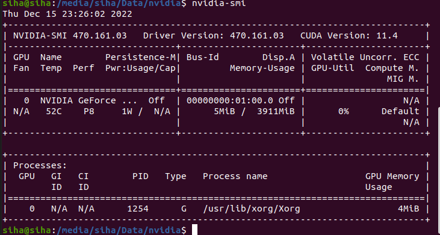
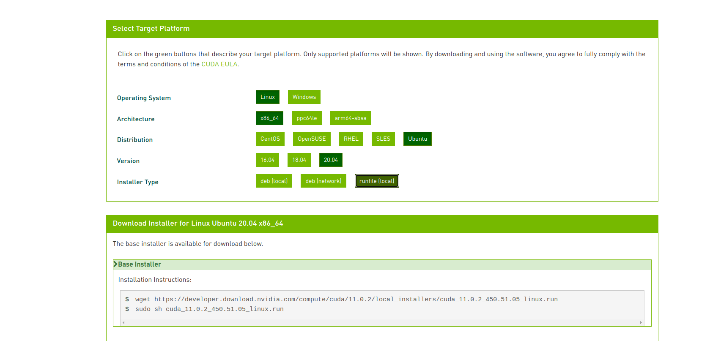
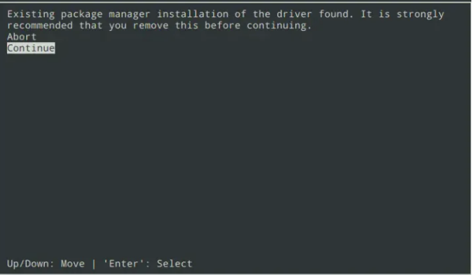
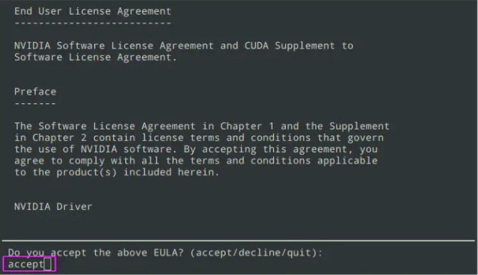
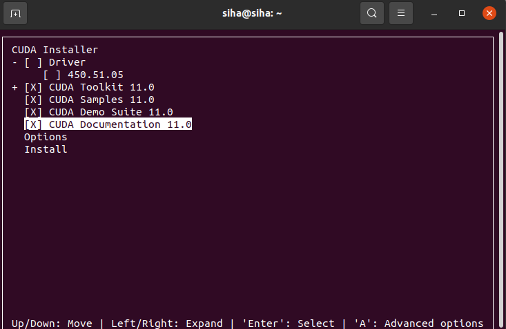
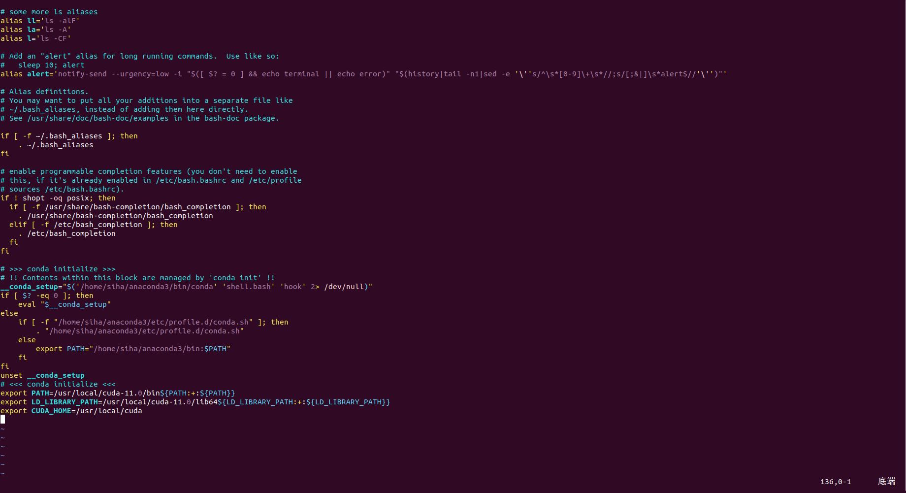
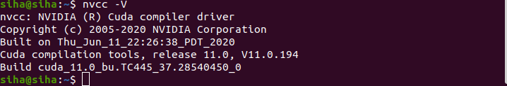
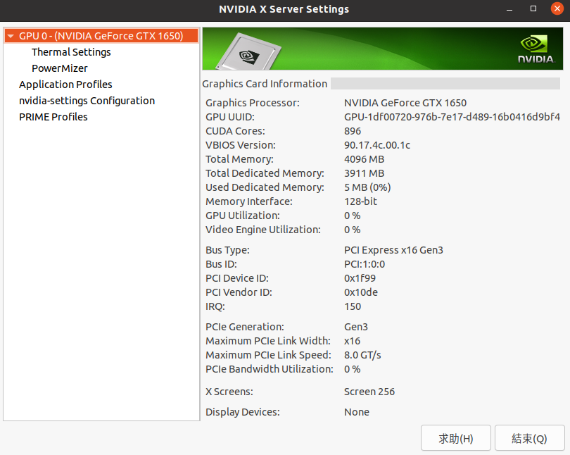

Ubuntu 20.04安裝NVIDIA驅動和CUDA
======

### 下載NVIDIA驅動

+ 獲取驅動訊息

```

ubuntu-drivers devices

```



+ 這邊選擇nvidia-driver-470，輸入指令

```

sudo apt install nvidia-driver-470

```

+ 安裝完後重起電腦，或輸入

```

sudo reboot

```

+ 重起後輸入

```

nvidia-smi

```



+ 可以看到Driver Version為 470.161.03，CUDA Version為11.4

### 下載CUDA安裝文件

+ 由於上圖可以得知CUDA最高支持版本為11.4，在NVIDIA官網下載，這邊下載11.0.2版本

```

https://developer.nvidia.com/cuda-toolkit-archive

```



+ 將上圖兩行指令做輸入

```

wget https://developer.download.nvidia.com/compute/cuda/11.0.2/local_installers/cuda_11.0.2_450.51.05_linux.run     (這下載完會在家目錄)

sudo sh cuda_11.0.2_450.51.05_linux.run     (在家目錄執行)(這邊如果沒辦法下載可以往下看)

```

+ 如果輸入sudo sh cuda_11.0.2_450.51.05_linux.run 沒辦法執行就先將gcc降級，若沒有可以忽略此步驟

```

sudo apt-get install gcc-7 g++-7

sudo update-alternatives --install /usr/bin/gcc gcc /usr/bin/gcc-7 100

sudo update-alternatives --install /usr/bin/gcc gcc /usr/bin/gcc-9 50

sudo update-alternatives --install /usr/bin/g++ g++ /usr/bin/g++-7 100

sudo update-alternatives --install /usr/bin/g++ g++ /usr/bin/g++-9 50

```

+ 執行完sudo sh cuda_11.0.2_450.51.05_linux.run後會出現此畫面，選擇Continue



+ 在輸入accept



+ 接下來這邊要注意一下，剛剛已經有安裝Driver驅動了，因此取消對Driver的選取，其他都選，點Install，取消選取是點空白鍵



+ 安裝完後要增加環境變量PATH，如果不知道自己CUDA安裝位置可以打上

```

sudo find / -name cuda

```


+ 接下來用vim打開~/.bashrc，若未安裝vim輸入

```

sudo apt-get install vim

vim ~/.bashrc

```

+ 進去後在最後一行輸入以下指令後儲存離開

```

export PATH=/usr/local/cuda-11.0/bin${PATH:+:${PATH}}

export LD_LIBRARY_PATH=/usr/local/cuda-11.0/lib64${LD_LIBRARY_PATH:+:${LD_LIBRARY_PATH}}

export CUDA_HOME=/usr/local/cuda

```



+ 在CMD輸入

```

nvcc -V

```



+ 或在CMD輸入

```

nvidia-settings

```



+ 以上兩個畫面都有代表安裝成功
